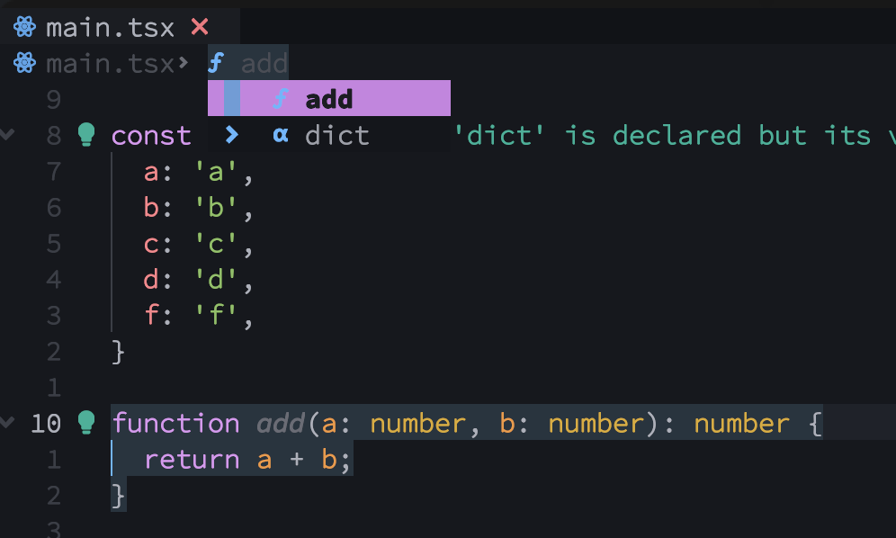
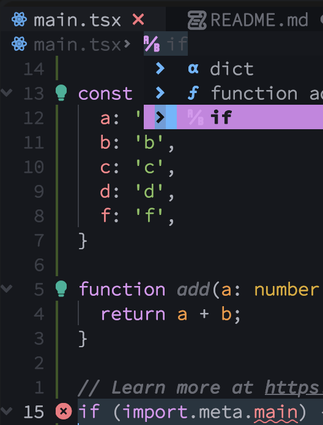

# Dropbar.nvim out of order symbols

This repo serves to help on investigating the issue I'm about to report for
[Bekaboo/dropbar.nvim](https://github.com/Bekaboo/dropbar.nvim).

## Problem statement

When sourcing in some contexts/scopes, the symbols are listed in a different
order than they're available on the file;



## Reproduce steps

I've used AstroNVIM to speed up the setup, so hopefully it will be straight forward:

```sh
git clone --depth 1 https://github.com/edygar/dropbar-repro-repo ~/.config/dropbar-repro-repo
cd ~/.config/dropbar-repro-repo/
NVIM_APPNAME=dropbar-repro-repo nvim --headless -c "MasonInstall vtsls" -c qall
NVIM_APPNAME=dropbar-repro-repo nvim main.tsx
```

Now, placing the cursor on line 10 and pressing <code>Space</code><code>j</code> and then `b` will open the
dropbar menu like the following:


But when placing the cursor on line 15 it brings a more expected scenario


